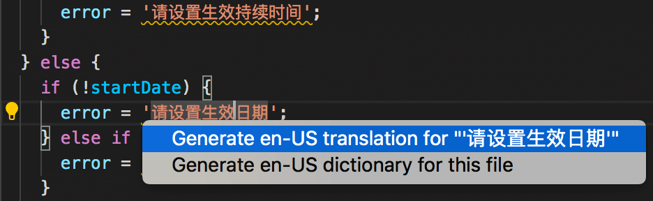

# VS Code extension for @jacklu/babel-plugin-i18n

This extension integrates [babel-plugin-i18n](http://github.com/panlina/babel-plugin-i18n) into VS code, which highlights untranslated texts and helps you generate translations.

## Diagnostics

Untranslated texts will be highlighted as problems.

Dictionary issues will also be highlighted as problems.

Note that currently diagnostics only update on save (both source file and dictionary file).

## Translation generation

Translation generation is provided as quick fixes and explorer context menu command. You can generate translation for single text, or generate/regenerate dictionary for whole file/directory.

## Translation report

You can generate report for file/directory to see coverage of translations.

## Find translations

You can find translation for text thru `Go to References` (or `Peek References`, etc.).
